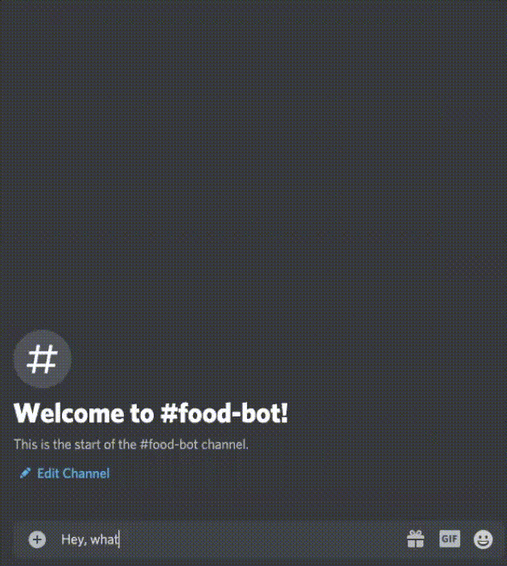
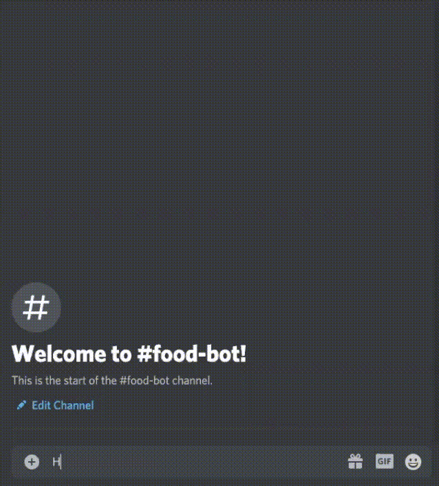
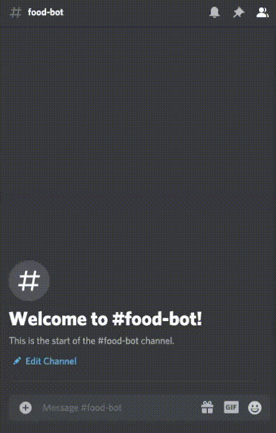
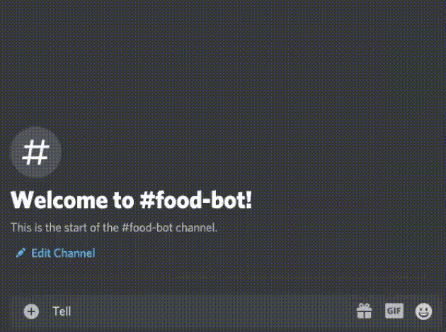

# food-b🍩t 

## About
food-bot is a NLP [Discord](https://discordpy.readthedocs.io/en/latest/api.html#) chatbot that suggests recipes to cook based on your preferences through using conversational AI. I created food-bot to help me discover new recipes and to provide an easy and fun interface to chat with. Through using [discordpy](https://github.com/Rapptz/discord.py), a modern python API wrapper for Discord, I was able to read and send messages to the channel. I used the [spoonacular API](https://spoonacular.com/food-api) to request recipe data using different endpoints such as *Search Recipes by Ingredients* and *Get Similar Recipes*. The chatbot is implemented using pytorch and popular NLP python libraries. 

## Features
- Offers basic greetings
- Tells funny food-related jokes
- Finds appropriate recipes based on user preferences, taking dietary restrictions and intolerances into account
  - Sends similar recipes upon request (reaction-based input handling)
  
## Use Cases

| What can I make with the ingredients in my fridge?     | I don't know what to cook, send me a random recipe. |
| ----------- | ----------- |
|     |       |

| Suggest a few dessert recipes for me based on my dietary preferences. | Tell me a joke. |
| ----------- | ----------- |
| |  |

1. What can I make with the ingredients in my fridge?

2. I don't know what to cook, send me a random recipe.

3. Suggest a few dessert recipes for me based on my dietary preferences.

4. Tell me a joke.

  
## The Model 
I chose a feed forward neural network with 2 hidden layers, which was able to learn well given the training data. This was the best choice for detection of patterns in text to predict user input and then select choose the best response by food-bot. 
The code for the implementation of the feed-forward 2-layer neural net is borrowed from [here](https://github.com/python-engineer/pytorch-chatbot).

## Why the spoonacular API?
The API has access to thousands of recipes, and provides an efficient way to search for recipes matching my preferences. I used multiple endpoints to retrieve different pieces of recipe information, and stitched the info together for each picture by constructing a discord embed, which displayed a picture of the recipe and its relevant info.

## Customization
Currently, food-bot is programmed to retrieve random recipes, recipes given ingredients, and recipes given a meal type based on my dietary preferences. In the future, I will be expanding food-bot's capabilities to handle the needs of other humans. 

## What I Learned
- Gained asynchronous programming knowledge using async/await 
- Improved my understanding of neural nets and how to implement one in python
- How to apply NLP techniques such as stemming, lemmatization
- How to interact with an API
